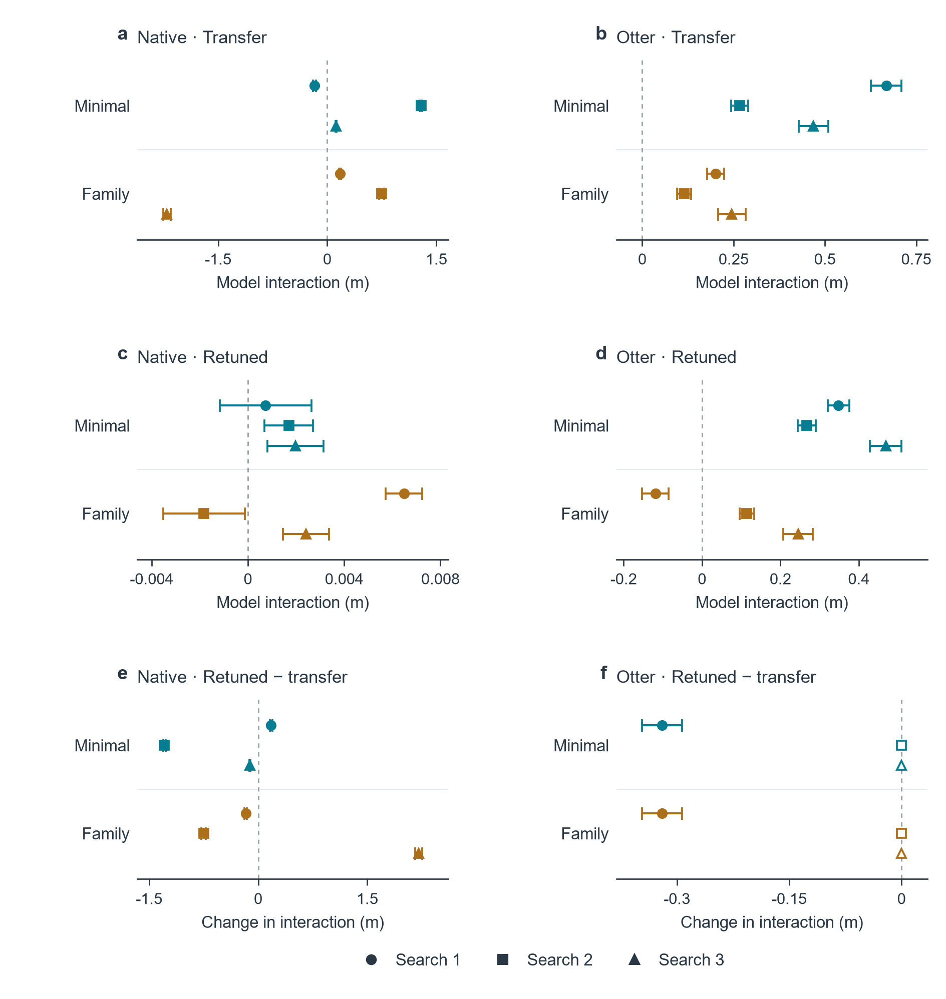
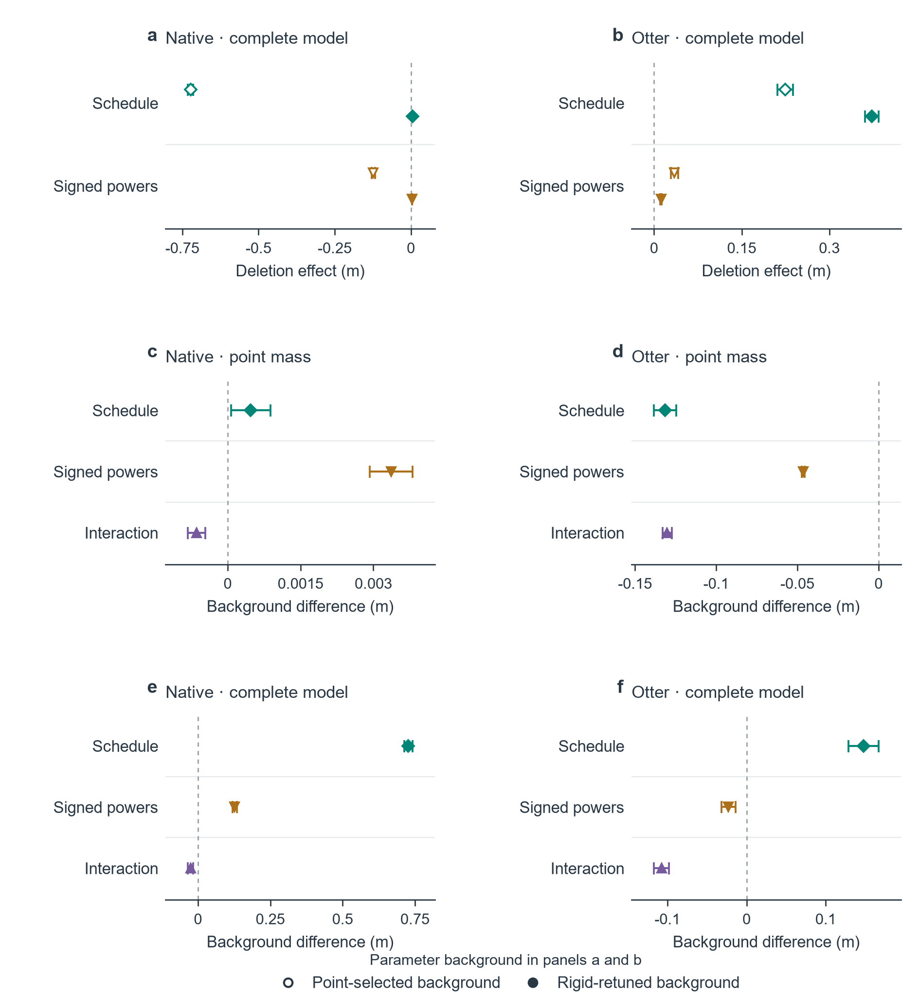

# 异构编队控制中的控制器排序与模块收益：执行机构模型与等预算调参

英文题目：Controller rankings and module benefits in heterogeneous formation control: Actuation models and equal-budget tuning

作者：Fuliang Ma、Yuzhen Dang、Yuping Ma、Ying Jiang、Hongbin Ma。单位：青海大学；中国移动通信集团青海有限公司。通讯作者：Yuzhen Dang（dyzivy@qhu.edu.cn）。

## 摘要

编队控制器的比较结果取决于车辆模型及为其选择的参数。我们在八个无人平台组成的空海异构平台和独立的四艘Otter船舶模型中，将三种模型层级与参数选择策略交叉考察。三个模块化控制器和一个采样实现的分布式误差符号鲁棒积分（RISE）控制器获得相同评估预算。三次独立搜索分别为每种方法、每个平台分配2,880次开发评估，随后在每个平台50个留出种子块上测试。每次搜索的12个配对对比使用同时bootstrap区间。另一组析因实验将两个模块开关与两个冻结参数背景交叉。三次搜索中，在质点模型选参后迁移时，原生平台Full减Minimal的完整模型减质点误差交互范围为−0.177至1.290 m；按模型重调后为0.00073至0.00198 m。Otter重调后的交互保持为正，范围为0.267至0.469 m。在原生完整模型中，删除增益调度在质点选参背景下使平均误差改变−0.7224 m，在完整模型选参背景下改变+0.00485 m；删除符号幂的效应也改变符号。全部33,900次重复搜索测试和9,600次析因测试均有有限终点。在1,740项数值检查中，三个RISE条件在正式步长下未通过，细化后通过。比较结果随搜索改变，模块效应取决于参数背景，两者均不支持普遍的控制器排序。三次搜索对搜索变异性提供的证据有限。尚未解决的源条件重建、压力诊断及软件在环失败进一步限制了计算结论。

## 2026年9月9日完整精简复现版

本版包含原公共精简包、补充材料S15分析、三次独立搜索和两模块×两背景交叉干预的全部逐运行指标、冻结设计、选参结果、统计输出及最新图件数据，另附71份原始NPZ数组。原始数组采用无损保存，不降采样、不改变精度、不改变实验结果。

使用GitHub的Code → Download ZIP下载整个仓库，或克隆仓库。所有文件和payloads文件夹必须一起保留。每个上传文件均小于25 MiB；本地整包ZIP超过网页单文件限额，因此应上传仓库文件夹的内容，不应把整包ZIP作为一个文件上传。核验和统计重算不需要下载外部实验数据或使用Git LFS。

## 环境与命令

使用Python 3.12，单独创建环境并安装requirements.txt。版本与检查过的Windows Python 3.12.14一致；联网全新安装、Linux和macOS尚未验证。冻结代码的来源清单包含Windows路径。不要使用python -O。PowerShell示例：

```powershell
python -m venv .venv
.\.venv\Scripts\python.exe -m pip install -r requirements.txt
.\.venv\Scripts\Activate.ps1
python -B reproduce.py verify
python -B reproduce.py prepare
python -B reproduce.py verify-inputs
python -B reproduce.py latest-results
python -B reproduce.py latest-audit
python -B reproduce.py traces
python -B reproduce.py latest-figures --dpi 150
```

verify检查仓库与压缩数据的SHA-256；prepare校验并解压到outputs/workspace；verify-inputs再次检查全部解压输入及原基线清单。latest-results重算31份最新统计输出并与冻结结果逐字节对比；latest-audit独立重建三次开发选参、配对均值和四个主要检验族的同时区间。traces检查71份NPZ的CRC、数组和记录映射，从保存的时间序列重算J、实际力和力矩区间平方积分之和。该检查不独立重建数值合格判据。latest-figures绘制图9、10、S6和图形摘要；投稿位图使用--dpi 1000，同时提供PDF和SVG。

latest-all顺序执行最新统计、独立审计、绘图和数组核验。解压会缓存；需重新检查全部解压输入时使用verify-inputs。全部结果、核验报告、日志和缓存保存在被Git忽略的outputs目录，输入修改后应重新解压到新目录。上述命令不运行新仿真，指标重算也不能替代动力学重跑。

旧实验与S15仍可复现：

```powershell
python -B reproduce.py baseline-results
python -B reproduce.py baseline-selection
python -B reproduce.py baseline-figures
python -B reproduce.py previous-results
python -B reproduce.py baseline-test
```

baseline-figures生成既有图1–8及S1–S5，与latest-figures合起来覆盖当前图件。previous-results处理S15的直接对比、条件敏感性、开发选参及代数分配示例。原公开ZIP按原字节保存在payloads/baseline.zip，其SHA-256为c395fa58838d5420c8f896ba52cfd25f0ad5465142f4095e7abf37431f94ad79，对应旧GitHub提交fbfa3fb2a2eb6eb2e63f28258e1ab59db86a84f5。旧提交不包含新实验；原基线内部文件描述旧版，当前范围以仓库根说明为准。

## 原始数组与解释边界

包括全部112,620份新增普通逐运行记录和1,740份数值条件记录。71份原始NPZ由56个按固定设计条件选取的正式示例、三项RISE未合格条件的15份参考解及各步长数组组成。正式示例按各平台最小种子、椭圆轨迹、无流选取，不按效果挑选；不是随机样本，也不是全部120,804份新NPZ。完整新数组及旧PX4原始日志仍在作者完整归档中，本包不宣称它们已全部公开。

baseline-smoke会明确启动旧基线32个代表性仿真，属于单独命令。新实验的原始运行代码与冻结设计在解压后的campaign目录中；由于缺少完整轨迹缓存，直接运行campaign_runner.py all可能重跑大量缺失任务，不是快速核验。完整重跑需要额外时间和存储，本次打包未重跑完整科学实验。

三次搜索仍只算三次；三组搜索和析因实验分别保留各自12项同时区间，次要逐点区间仍为次要分析，共享执行ID不增加样本数。三项RISE正式步长限制、未完成源条件重建、旧压力诊断和未具备推断资格的PX4假设族均保留。文件核验通过不代表实物验证或普遍排序成立。

原创代码使用MIT，原创数据和图件使用CC BY 4.0，第三方权利与署名保留。OpenAI Codex协助代码、文档和核查；科学内容及最终批准由作者负责。本仓库不包含投稿信、作者待办或修改过程记录。详细范围见DATA_COVERAGE.md，实际核验结果见VALIDATION.md。


## 结果预览




